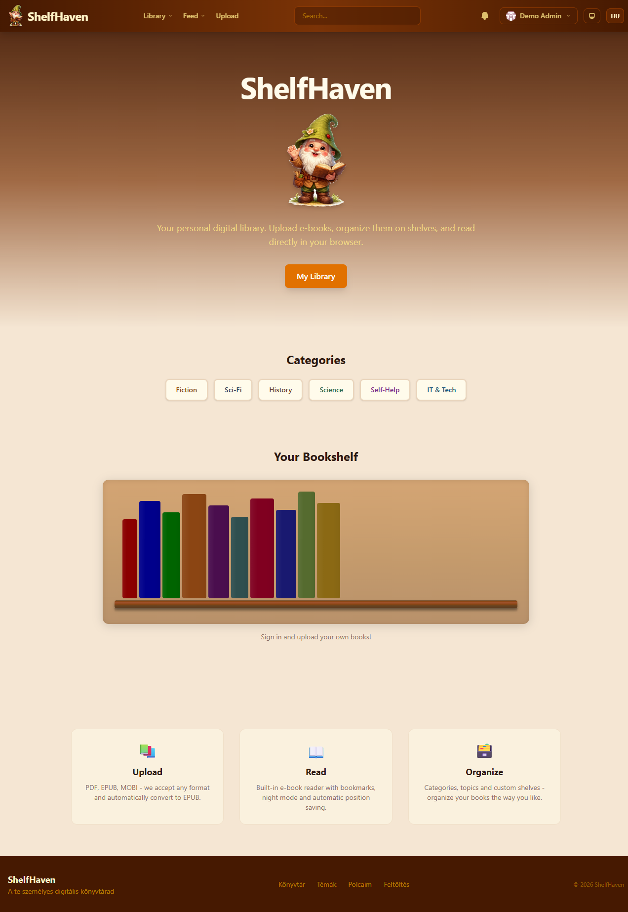
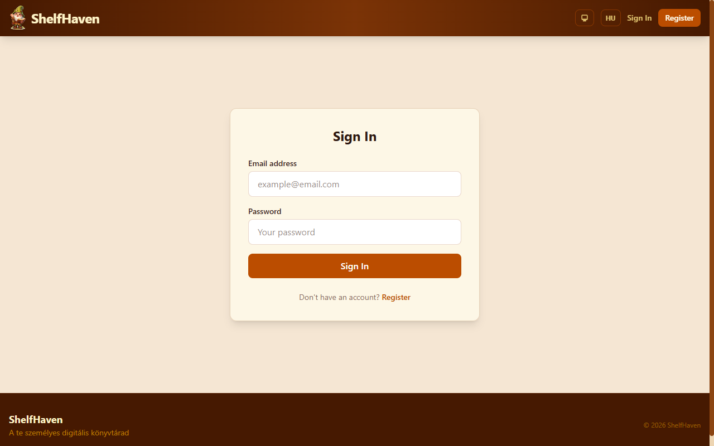
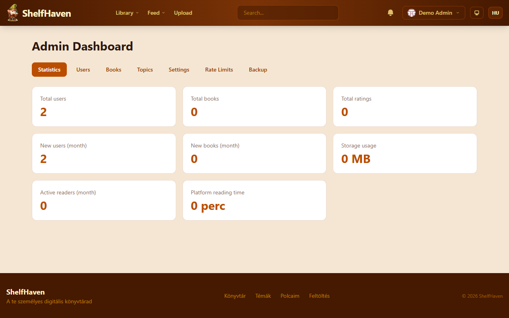
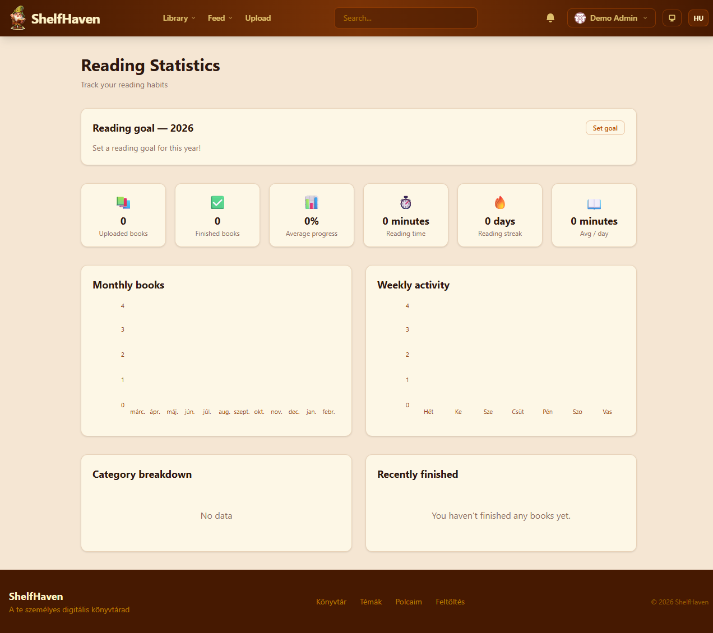

<p align="center">
  
  
  
  
  
  
</p>

# ShelfHaven

<p align="center">
  <strong>Webes e-könyvtár platform könyvespolc felülettel, beépített EPUB olvasóval és közösségi funkciókkal.</strong>
</p>

<p align="center">
  <a href="README.md">🇬🇧 English</a> | <strong>🇭🇺 Magyar</strong>
</p>

<p align="center">
  <a href="#képernyőképek">Képernyőképek</a> •
  <a href="#funkciók">Funkciók</a> •
  <a href="#gyors-indítás">Gyors indítás</a> •
  <a href="#konfiguráció">Konfiguráció</a> •
  <a href="#technológiák">Technológiák</a> •
  <a href="#éles-üzem">Éles üzem</a> •
  <a href="#biztonság">Biztonság</a> •
  <a href="#tesztelés">Tesztelés</a>
</p>

---

<table>
<tr>
<td width="80" align="center">
  
</td>
<td>
  <strong>📱 ShelfHaven Mobil App — Hamarosan!</strong><br/>
  Natív Android alkalmazás Kotlin &amp; Jetpack Compose technológiával.<br/>
  Szinkronizálja a könyvtáradat, olvasási előrehaladásodat és könyvjelzőidet minden eszközödön.
</td>
<td width="200" align="center">
  <br/>
  <sub>█████████████░░ 85%</sub>
</td>
</tr>
</table>

---

## Miért ShelfHaven?

Az e-könyveid szétszórva hevernek különböző eszközökön. Szeretnél egy szép, saját hosztolt könyvtárat, ahol feltöltheted, rendszerezheted és olvashatod őket — igazi könyvespolc hangulattal, nem unalmas fájllistával.

A **ShelfHaven** egy teljes e-könyvtár platform, ami Dockerben fut. Tölts fel EPUB-okat (vagy PDF/MOBI fájlokat — automatikusan konvertálódnak), rendezd őket virtuális könyvespolcokon kategóriák és témák szerint, és olvasd a beépített EPUB olvasóval sötét móddal, könyvjelzőkkel és kiemelésekkel.

Hívd meg a barátaidat → böngészhetik a könyvtáradat, menthetnek könyveket, kommentelhetnek és követhetik egymást. Ennyi.

---

## Képernyőképek

<p align="center">
  
</p>

<p align="center">
  <em>Kezdőoldal — kabalafigura, kategóriák és a könyvespolcod egy pillantásra</em>
</p>

<p align="center">
  
  &nbsp;&nbsp;
  
</p>

<p align="center">
  <em>Bejelentkezés &nbsp;|&nbsp; Admin vezérlőpult statisztikákkal</em>
</p>

<p align="center">
  
</p>

<p align="center">
  <em>Olvasási statisztikák — célok, sorozatok és grafikonok</em>
</p>

---

## Funkciók

- **Könyvespolc felület** 3D gerinc effektekkel és gördülékeny animációkkal (Framer Motion)
- **Beépített EPUB olvasó** — sötét mód, betűtípus beállítások, könyvjelzők, kiemelések, annotációk
- **Automatikus konverzió** — tölts fel PDF/MOBI/AZW3/FB2/CBR fájlokat, a Calibre EPUB-ba konvertálja
- **Közösségi funkciók** — felhasználók követése, könyvek kommentelése, tevékenység feed, felfedezés oldal
- **Mentés a könyvtáramba** — mások könyveinek mentése a saját gyűjteménybe
- **Egyéni polcok** — könyvek rendszerezése nyilvános vagy privát polcokra
- **Kategóriák és témák** — színkódolt címkék, automatikus kategorizálás metaadatokból
- **Admin vezérlőpult** — felhasználókezelés, könyv moderáció, teljes mentés/visszaállítás (ZIP)
- **PWA + offline** — telepítés alkalmazásként, könyvek olvasása offline (IndexedDB)
- **Többnyelvű** — magyar + angol, cookie-alapú nyelv felismerés
- **Biztonsági szint** — OWASP audit megfelelt, rate limiting, CSRF, CSP, brute-force védelem

---

## Gyors indítás

### 1. Klónozás és beállítás

```bash
git clone <repo-url>
cd ShelfHaven
cp .env.example .env
```

Szerkeszd a `.env` fájlt — változtasd meg a jelszavakat:

```bash
MYSQL_ROOT_PASSWORD=erős_jelszó
MYSQL_PASSWORD=adatbázis_jelszó
NEXTAUTH_SECRET=generald-openssl-rand-base64-32
MINIO_ROOT_PASSWORD=minio_jelszó
```

### 2. Indítás Docker Compose-zal

```bash
docker compose up -d
# Az első indítás ~3-5 percig tart a build miatt
```

### 3. Megnyitás és bejelentkezés

Nyisd meg a **http://localhost:3000** címet — egy alapértelmezett admin fiók automatikusan létrejön:

| | |
|---|---|
| **Email** | `demo@demo.hu` |
| **Jelszó** | `Demo123!` |

> **Fontos:** Éles környezetben változtasd meg a jelszót, vagy hozz létre saját admin fiókot!

### 4. Könyvek feltöltése

Menj a **Feltöltés** oldalra, húzd be az e-könyveidet (EPUB, PDF, MOBI — max 50MB), és megjelennek a könyvespolcodon.

<details>
<summary><strong>Fejlesztői mód (hot-reload)</strong></summary>

```bash
npm install
npx prisma generate
npx prisma db push
npm run dev
```

Node.js 22+ és futó MySQL + MinIO szükséges.

</details>

---

## Docker szolgáltatások

| Szolgáltatás | Port | Leírás | Állapotellenőrzés |
|---------|------|-------------|-------------|
| `app` | 3000 | Next.js alkalmazás | `wget /api/health` |
| `db` | 3306 | MySQL 8.4 adatbázis | `mysqladmin ping` |
| `minio` | 9000 / 9001 | Fájl tároló (API / konzol) | `curl /minio/health/live` |
| `calibre` | 8080 | E-könyv konverziós szerver | `curl /health` |

```bash
docker compose up -d              # Összes szolgáltatás indítása
docker compose down               # Összes szolgáltatás leállítása
docker compose logs -f app        # Alkalmazás log követése
docker compose build --no-cache app  # Teljes újraépítés
```

---

## Konfiguráció

| Változó | Alapértelmezett | Leírás |
|----------|---------|-------------|
| `MYSQL_ROOT_PASSWORD` | — | MySQL root jelszó |
| `MYSQL_PASSWORD` | — | MySQL alkalmazás felhasználó jelszó |
| `NEXTAUTH_SECRET` | — | Auth titkosító kulcs (min 32 karakter!) |
| `NEXTAUTH_URL` | `http://localhost:3000` | Nyilvános alkalmazás URL |
| `AUTH_TRUST_HOST` | `true` | Reverse proxy mögött `true` |
| `MINIO_ROOT_USER` | `minioadmin` | MinIO hozzáférési kulcs |
| `MINIO_ROOT_PASSWORD` | — | MinIO titkos kulcs |
| `MINIO_PUBLIC_ENDPOINT` | `localhost` | MinIO nyilvános hostnév |
| `APP_PORT` | `3000` | Alkalmazás port |

> **Titkos kulcs generálás:** `openssl rand -base64 32`

<details>
<summary><strong>Opcionális beállítások (admin panelen konfigurálható)</strong></summary>

Ezek az adatbázis `Setting` táblájában tárolódnak, és az admin vezérlőpultról módosíthatók:

- **OIDC:** `oidc_enabled`, `oidc_issuer`, `oidc_client_id`, `oidc_client_secret`, `oidc_only`
- **SMTP:** `smtp_host`, `smtp_port`, `smtp_user`, `smtp_pass`, `smtp_from`
- **Kapcsolók:** `email_verification_enabled`, `registration_enabled`

</details>

---

## Technológiák

| Réteg | Technológia |
|-------|-----------|
| **Frontend** | Next.js 16 (App Router), React 19, TypeScript |
| **Stílusok** | Tailwind CSS 4, shadcn/ui (Radix UI), Framer Motion |
| **Backend** | Next.js API Routes, Prisma ORM v7 |
| **Adatbázis** | MySQL 8.4 (Docker) |
| **Autentikáció** | NextAuth.js v5 (Auth.js) — jelszó + OIDC (Authentik) |
| **Tároló** | MinIO (S3-kompatibilis, Docker konténer) |
| **E-könyv** | EPUB.js (böngésző olvasó), Calibre CLI (konverzió) |
| **Többnyelvűség** | next-intl v4 (magyar + angol) |
| **Állapotkezelés** | Zustand |
| **Validáció** | Zod v4 + React Hook Form |
| **Tesztelés** | Vitest (unit) + Playwright (E2E) |
| **Infrastruktúra** | Docker Compose (4 szolgáltatás) |

---

## Éles üzem

```
                    ┌─────────────┐
   HTTPS (443)      │   Reverse   │
  ─────────────────>│   Proxy     │
                    │ (nginx/NPM) │
                    └──────┬──────┘
                           │ :3000
                    ┌──────┴──────┐
                    │   Next.js   │  frontend hálózat
                    │    (app)    │
                    └──┬───┬───┬──┘
                       │   │   │     backend hálózat (belső)
                 ┌─────┘   │   └─────┐
                 │         │         │
            ┌────┴───┐ ┌───┴──┐ ┌───┴────┐
            │ MySQL  │ │MinIO │ │Calibre │
            │  8.4   │ │      │ │  CLI   │
            └────────┘ └──────┘ └────────┘
```

<details>
<summary><strong>Éles üzem ellenőrzőlista</strong></summary>

Állítsd be a `.env` fájlban:
- `NEXTAUTH_SECRET` — generálás: `openssl rand -base64 32`
- `MYSQL_ROOT_PASSWORD`, `MYSQL_PASSWORD` — erős jelszavak
- `MINIO_ROOT_PASSWORD` — erős jelszó
- `NEXTAUTH_URL` — a domain neved (pl. `https://yourdomain.com`)
- `MINIO_PUBLIC_ENDPOINT` — a domain neved

Architektúra:
- Két hálózat: `frontend` (nyilvános) + `backend` (belső, nem elérhető kívülről)
- Memória limitek: app 512MB, calibre 1GB
- JSON log driver (max 10MB x 5 fájl konténerenként)
- Reverse proxy (nginx, Caddy vagy NPM) szükséges a HTTPS-hez

</details>

---

## Biztonság

### Implementált védelmek

| Réteg | Részletek |
|-------|--------|
| **Autentikáció** | NextAuth.js v5 (JWT, 24 órás lejárat) |
| **OIDC** | Authentik integráció (admin-konfigurálható) |
| **CSRF** | Origin/Host validáció minden módosító végponton |
| **Rate limiting** | Memória-alapú, 7 előbeállítás (auth: 10/15perc, API: 60/perc, nyilvános: 30/perc) |
| **Brute-force** | 5 próbálkozás → 15 perces zárolás (email alapján) |
| **CSP** | Szigorú Content-Security-Policy |
| **Fejlécek** | HSTS, X-Frame-Options DENY, nosniff, COOP, CORP, Permissions-Policy |
| **EPUB biztonság** | ZIP bomba védelem (5000 fájl limit, arány érzékelés) |
| **SSRF** | Privát IP ellenőrzés borítóletöltésnél (átirányítás után is) |
| **Fájl validáció** | Magic bytes 8 formátumra (EPUB, PDF, MOBI, AZW3, FB2, CBR, DOCX, RTF) |
| **Elavult JWT** | DB ellenőrzés 5 percenként, törölt felhasználó token érvénytelenítés |
| **Bemenet** | Zod v4 validáció minden API végponton |

<details>
<summary><strong>Audit eredmények (2026-02-23)</strong></summary>

- **15/15 input validációs teszt MEGFELELT** (SQLi, XSS, path traversal, XXE)
- **Minden védett végpont** helyesen 401-et ad vissza auth nélkül
- **CORS:** deny-all irányelv
- **Összesített értékelés: A-**

</details>

---

## Adatbázis séma (24 tábla)

```
User ─────┬── Book ────────┬── ReadingProgress
          │                ├── Bookmark
          ├── Account      ├── Highlight
          ├── Session      ├── Review
          ├── Shelf ──── ShelfBook
          ├── Follow       ├── Like
          ├── Activity     ├── SavedBook
          ├── Comment      ├── SharedLink
          ├── Notification ├── Comment
          └── ReadingGoal  ├── BookCategory ── Category
                           └── BookTopic ──── Topic

Önálló: Setting, VerificationToken
```

---

## Tesztelés

```bash
npm run test:run          # Unit tesztek (Vitest)
npm run test:e2e          # E2E tesztek (Playwright)
npm run test:e2e:ui       # E2E interaktív felülettel
npx tsc --noEmit          # TypeScript ellenőrzés
```

| Típus | Darab | Keretrendszer |
|------|-------|-----------|
| Unit / Integrációs | 4 fájl | Vitest + React Testing Library |
| E2E | 22 fájl | Playwright (Chromium) |

---

## Projekt struktúra

<details>
<summary><strong>Kattints a kibontáshoz</strong></summary>

```
ShelfHaven/
├── src/
│   ├── app/                    # Next.js App Router
│   │   ├── (auth)/             # Bejelentkezés, regisztráció, email megerősítés
│   │   ├── (main)/             # Fő oldalak (17 oldal)
│   │   ├── (reader)/           # Olvasó layout (külön)
│   │   └── api/                # REST API (~85 végpont)
│   ├── components/             # React komponensek
│   │   ├── bookshelf/          # BookSpine, ShelfScene, BookCover, SaveToLibraryButton
│   │   ├── reader/             # EpubReader
│   │   ├── social/             # ActivityCard, CommentSection, FollowButton
│   │   ├── discover/           # DiscoverSection, TrendingCard
│   │   ├── admin/              # BackupPanel
│   │   └── layout/             # Header, Footer
│   ├── lib/                    # Segédeszközök
│   │   ├── auth.ts             # NextAuth konfig + brute-force + OIDC
│   │   ├── prisma.ts           # Prisma kliens singleton
│   │   ├── storage/minio.ts    # MinIO S3 kliens
│   │   ├── backup/             # Admin mentés és visszaállítás
│   │   └── ebook/              # EPUB feldolgozó, Calibre kliens, borító eszközök
│   ├── hooks/                  # Egyéni React hookok
│   ├── store/                  # Zustand store-ok
│   └── types/                  # TypeScript típus definíciók
├── prisma/
│   ├── schema.prisma           # Adatbázis séma (24 tábla)
│   └── init.sql                # Automatikusan generált létrehozó script
├── messages/                   # Fordítások (hu + en)
├── tests/                      # Unit (4) + E2E (22) tesztek
├── docker/calibre/             # Calibre konverziós szerver (Python)
├── docker-compose.yml          # Docker Compose (egységes, 4 szolgáltatás)
├── Dockerfile                  # Többlépcsős build (4 fázis)
└── docker-entrypoint.sh        # Automatikus DB inicializálás + migráció
```

</details>

---

## Verziótörténet

| Verzió | Dátum | Változások |
|---------|------|---------|
| **v3.5** | 2026-03 | Olvasó keresés és slider, nézet mód mentés, borítókép feltöltés, frissítés gomb, Harbor CI/CD, mobil app társalkalmazás |
| **v3.4** | 2026-02 | SavedBook (mások könyveinek mentése), auth cookie HTTPS javítás, polc dropdown javítás |
| **v3.3** | 2026-02 | Admin mentés és visszaállítás (ZIP), biztonsági audit, email/regisztráció kapcsolók |
| **v3.2** | 2026-02 | Közösségi: Követés, Komment, Tevékenység, Felfedezés |
| **v3.1** | 2026-01 | Teljesítmény (Blurhash, PWA, offline), annotációk, 6 új E2E teszt |
| **v3.0** | 2026-01 | Alaprendszer: feltöltés, olvasás, polcok, kategóriák, témák, admin, többnyelvűség |

---

## Támogatók

<p align="center">
  <a href="https://infotipp.hu"></a>
  &nbsp;&nbsp;&nbsp;&nbsp;
  <a href="https://brutefence.com"></a>
</p>

---

## Licenc

A projekt az [MIT Licenc](LICENSE) alatt áll.

## Jogi nyilatkozat

Ez a szoftver kizárólag **legálisan beszerzett** e-könyvek és digitális tartalmak kezelésére szolgál. A fejlesztők nem felelősek a szoftver felhasználásának módjáért. Kizárólag a felhasználó/üzemeltető felelőssége, hogy betartsa az adott joghatóságban érvényes szerzői jogi törvényeket és előírásokat. Szerzői joggal védett tartalmak jogosulatlan terjesztése szigorúan tilos.
